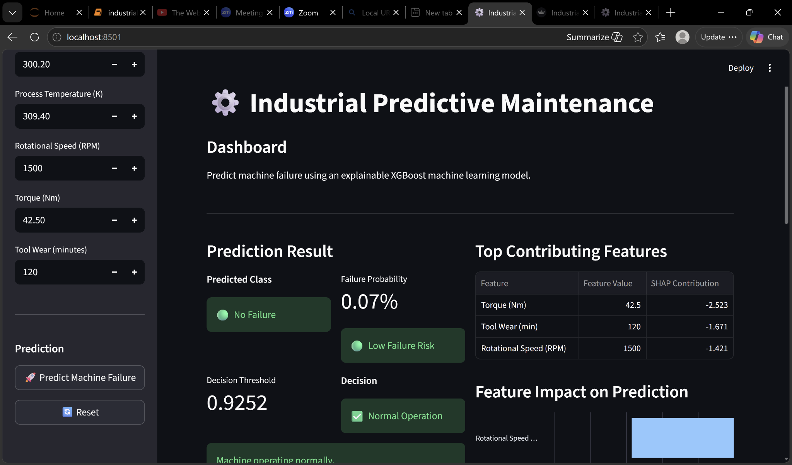
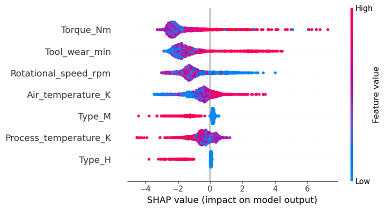
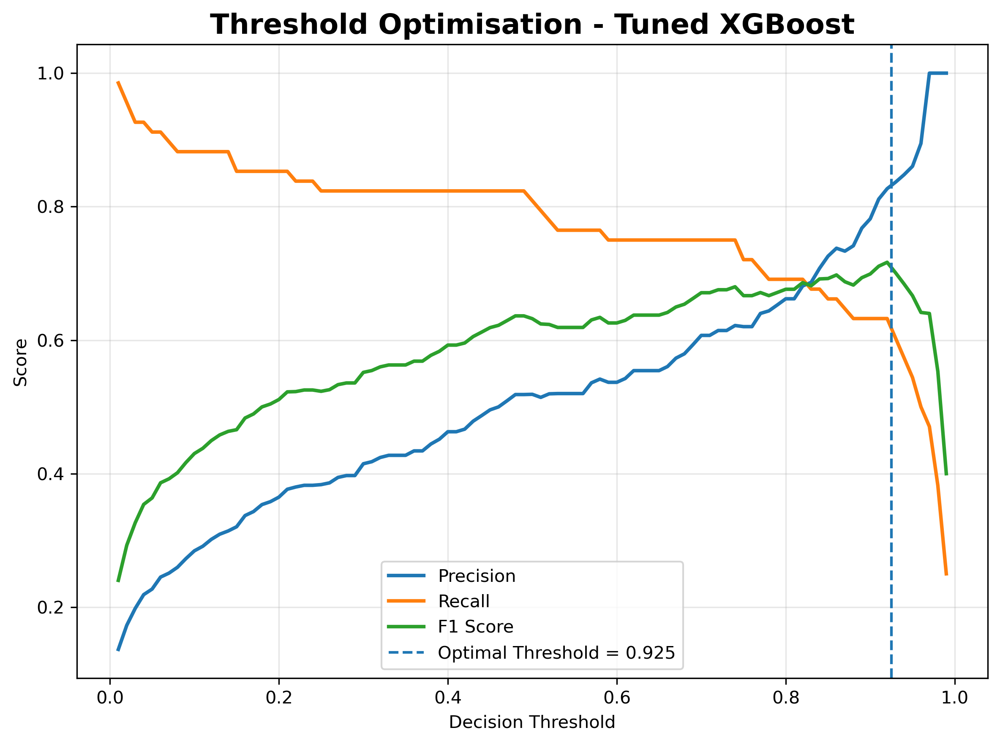

# Industrial Predictive Maintenance Using Explainable Machine Learning

An end-to-end predictive maintenance system for machine failure prediction using tuned XGBoost, SHAP explainability, FastAPI, Supabase, and an interactive Streamlit operational dashboard.

## Project Overview

Unexpected industrial equipment failures can cause unplanned downtime, maintenance costs, production disruption, and reduced operational efficiency.

This project develops an end-to-end explainable machine learning system for predicting machine failure from operational conditions using the AI4I 2020 Predictive Maintenance Dataset.

The machine learning workflow evaluates Logistic Regression, Random Forest, and XGBoost models. The final prediction system uses a tuned XGBoost classifier with SMOTE applied within the training pipeline to address class imbalance.

Beyond model prediction, the project includes an operational decision layer based on predicted failure probability and an optimised decision threshold of `0.9252`. SHAP explanations provide insight into the features influencing individual predictions.

The trained model is exposed through a FastAPI REST API. Prediction records are persisted in Supabase and presented through a Streamlit dashboard that supports prediction, explainability, historical monitoring, risk visualisation, and maintenance prioritisation.

## System Architecture

```text
AI4I 2020 Dataset
        |
        v
Data Preprocessing
        |
        v
Train/Test Split
        |
        v
SMOTE + Tuned XGBoost
        |
        v
Failure Probability
        |
        +----------------------+
        |                      |
        v                      v
Model Prediction       Operational Decision
                       Threshold = 0.9252
        |                      |
        +----------+-----------+
                   |
                   v
             SHAP Explanation
                   |
                   v
              FastAPI API
                   |
          +--------+--------+
          |                 |
          v                 v
       Supabase         Streamlit
       History          Dashboard
          |                 |
          +--------+--------+
                   |
                   v
       Monitoring and Maintenance
              Prioritisation
```

## Key Features

- Binary machine failure prediction using operational machine measurements.
- Comparison of Logistic Regression, Random Forest, and XGBoost classifiers.
- SMOTE integrated within the training pipeline to address class imbalance.
- Stratified model development and evaluation.
- Hyperparameter optimisation for the final XGBoost model.
- Probability-based operational decision threshold.
- SHAP global and local explainability.
- Individual prediction feature-contribution analysis.
- FastAPI REST interface for model inference.
- Supabase persistence for prediction history.
- Streamlit dashboard for interactive prediction and monitoring.
- Operational overview of historical predictions.
- Risk-distribution visualisation.
- Failure-probability trend monitoring.
- Threshold-based maintenance alerts.
- Maintenance priority queue.
- Historical prediction filtering.
- Automated testing across machine learning and API components.

## Model Inputs

The production model uses seven features:

| Feature | Description |
| --- | --- |
| `Air_temperature_K` | Air temperature in Kelvin |
| `Process_temperature_K` | Process temperature in Kelvin |
| `Rotational_speed_rpm` | Rotational speed in revolutions per minute |
| `Torque_Nm` | Torque in Newton-metres |
| `Tool_wear_min` | Tool wear in minutes |
| `Type_M` | Encoded medium-quality machine type |
| `Type_H` | Encoded high-quality machine type |

Machine type `L` is represented by `Type_M = 0` and `Type_H = 0`.

## Prediction and Operational Decision Layer

The system distinguishes between the model's predicted class and the operational maintenance decision.

The XGBoost model produces a machine failure probability and class prediction. Separately, the application compares the failure probability with the configured operational threshold:

```text
Decision threshold = 0.9252
```

When the predicted failure probability reaches or exceeds this threshold, the application identifies the prediction as requiring maintenance attention.

This separation allows model output to be translated into an explicit operational decision rule rather than treating the classifier output alone as a maintenance action.

## Explainable AI

SHAP is used to explain the behaviour of the XGBoost model.

For individual predictions, the dashboard identifies the most influential features and their SHAP values.

- Positive SHAP values increase predicted failure risk.
- Negative SHAP values decrease predicted failure risk.
- Larger absolute SHAP values indicate greater influence on the prediction.

This provides users with both a prediction and an explanation of the operational factors that contributed most strongly to it.

## Model Performance

The final tuned XGBoost pipeline was evaluated on a held-out test set of 2,000 observations. Because machine failures are relatively rare in the dataset, performance is reported using class-specific metrics alongside ROC-AUC and PR-AUC rather than accuracy alone.

### Predictive Performance

| Metric | Result |
|---|---:|
| Accuracy | 96.80% |
| ROC-AUC | 0.9700 |
| PR-AUC | 0.7715 |
| Failure Precision | 51.89% |
| Failure Recall | 80.88% |
| Failure F1-score | 63.22% |

At the model's standard classification rule, 55 of the 68 failure cases in the held-out test set were detected. The confusion matrix was:

- True negatives: 1,881
- False positives: 51
- False negatives: 13
- True positives: 55

### Operational Decision Threshold

The application uses a separate operational decision threshold of **0.9252** for maintenance prioritisation. This threshold does not change the underlying model probabilities; it determines when a prediction is escalated to a maintenance-required decision.

At this threshold:

| Metric | Result |
|---|---:|
| Accuracy | 98.35% |
| Failure Precision | 84.31% |
| Failure Recall | 63.24% |
| Failure F1-score | 72.27% |

The threshold therefore produces fewer false maintenance alerts and substantially higher precision, while accepting lower failure recall. This trade-off illustrates why operational threshold selection should be interpreted in the context of maintenance objectives and the relative costs of missed failures and unnecessary interventions.
## Operational Dashboard

The Streamlit dashboard provides:

- machine-condition input controls;
- predicted machine state;
- failure probability;
- operational decision threshold;
- maintenance decision;
- SHAP feature contributions;
- prediction history;
- operational summary metrics;
- risk distribution;
- failure-probability trend;
- maintenance alerts;
- maintenance priority queue;
- history filtering.

Maintenance-alert severity is an application-level prioritisation rule and should not be interpreted as an additional machine learning prediction.

## Screenshots and Visual Results

### Streamlit Dashboard



The interactive dashboard combines machine input controls, model predictions, failure probability, SHAP explanations, operational monitoring, and maintenance decision support.

### SHAP Explainability



The SHAP summary visualises the global influence of the model features on predicted machine failure risk.

### Decision Threshold Optimisation



The threshold analysis supports the separation between predictive probability and the operational maintenance decision threshold used by the application.
## Prediction History

Predictions generated through the application can be persisted to Supabase.

Stored information includes machine inputs, predicted class, failure probability, decision threshold, operational decision, prediction timestamp, and SHAP explanation information.

The `/history` API endpoint provides recent records to the Streamlit monitoring interface.

## API

The FastAPI application exposes the model through REST endpoints.

### Health Check

```http
GET /health
```

Used to confirm that the API is running.

### Prediction

```http
POST /predict
```

Example request:

```json
{
  "Air_temperature_K": 298.9,
  "Process_temperature_K": 309.0,
  "Rotational_speed_rpm": 1410,
  "Torque_Nm": 65.7,
  "Tool_wear_min": 191,
  "Type_M": 0,
  "Type_H": 0
}
```

The response contains the predicted class, failure probability, operational decision threshold, decision prediction, and top SHAP contributors.

### Prediction History

```http
GET /history?limit=20
```

Returns recent stored prediction records.

## Technology Stack

| Component | Technology |
| --- | --- |
| Programming | Python |
| Data Processing | pandas, NumPy |
| Machine Learning | scikit-learn, XGBoost |
| Imbalanced Learning | imbalanced-learn / SMOTE |
| Explainable AI | SHAP |
| Statistical Evaluation | statsmodels |
| API | FastAPI, Uvicorn |
| Dashboard | Streamlit |
| Database | Supabase |
| Visualisation | Matplotlib, Altair |
| Testing | pytest |
| Model Persistence | joblib |
| Version Control | Git and GitHub |

## Project Structure

```text
industrial-predictive-maintenance-machine-learning/
|
|-- app/                         # FastAPI application and API routes
|-- data/
|   |-- raw/                     # Original dataset
|   `-- processed/               # Processed modelling dataset
|-- images/                      # EDA, evaluation and explainability figures
|-- models/                      # Trained production model
|-- notebooks/                   # Jupyter analysis and model-development notebook
|-- reports/                     # Evaluation outputs and reports
|-- src/                         # Reusable machine learning modules
|-- tests/                       # Automated ML and API tests
|-- streamlit_app.py             # Interactive operational dashboard
|-- .env.example                 # Environment-variable template
|-- .gitignore
|-- DATA_DICTIONARY.md
|-- LICENSE
|-- README.md
`-- requirements.txt
```

## Environment Compatibility

The production model was originally serialised using the following core machine learning environment:

```text
Python:             3.13.9
scikit-learn:       1.7.2
XGBoost:            3.2.0
imbalanced-learn:   0.14.0
pandas:             2.3.3
NumPy:              2.3.5
```

Because persisted Python machine learning objects can be sensitive to library-version changes, reproducing the compatible environment is recommended when loading the supplied model artifact.

## Installation

Clone the repository and enter the project directory:

```bash
git clone https://github.com/vivaluv/industrial-predictive-maintenance-machine-learning.git
cd industrial-predictive-maintenance-machine-learning
```

Create a virtual environment:

```bash
python -m venv venv
```

On Windows:

```powershell
.\venv\Scripts\Activate.ps1
```

Install the project dependencies:

```bash
python -m pip install --upgrade pip
pip install -r requirements.txt
```

## Environment Variables

Create a `.env` file in the project root using `.env.example` as the template:

```env
SUPABASE_URL=your_supabase_project_url
SUPABASE_KEY=your_supabase_key
```

Do not commit real credentials to version control.

## Running the FastAPI Backend

From the project root:

```powershell
.\venv\Scripts\python.exe -m uvicorn app.main:app --host 127.0.0.1 --port 8000
```

The API will be available locally on port `8000`.

## Running the Streamlit Dashboard

Keep the FastAPI server running and open another terminal:

```powershell
.\venv\Scripts\python.exe -m streamlit run .\streamlit_app.py
```

Streamlit will display the local dashboard address in the terminal.

## Testing

The project includes automated tests for:

- data loading and preprocessing;
- target and train/test validation;
- model construction and training;
- model evaluation;
- calibration and threshold optimisation;
- SHAP explainability;
- prediction utilities;
- model and JSON persistence;
- FastAPI health checks;
- normal and high-risk API predictions;
- prediction history;
- API input validation.

Run the complete test suite with:

```powershell
python -m pytest .\tests -v
```

Current validated status:

```text
31 passed
```

Dependency-level deprecation warnings from SHAP and the FastAPI/Starlette testing stack may be reported without affecting test success.

## Model Validation

The final system has been validated end to end using the compatible model environment.

Validation includes:

```text
Model loading              PASS
Normal-risk prediction     PASS
High-risk prediction       PASS
SHAP explanations          PASS
FastAPI                    PASS
Supabase history           PASS
Streamlit dashboard        PASS
Maintenance alerts         PASS
History filtering          PASS
Automated tests            31/31 PASS
```

## Reproducibility

The repository separates data preparation, training, evaluation, prediction, explainability, API logic, dashboard functionality, and automated testing into reusable components.

The trained production artifact is retained separately from development candidates and backups, while the compatible package environment is documented to support reproducible inference.

## Limitations

The project uses the AI4I 2020 benchmark dataset rather than live industrial sensor data. Results therefore demonstrate the machine learning and application architecture under benchmark conditions and should not be interpreted as validation for deployment on a specific physical machine or industrial site.

The maintenance threshold and alert-severity rules are operational decision rules implemented by the application. They would require domain-specific validation, cost analysis, safety assessment, and monitoring before use in a real industrial environment.

Model performance may also change under data drift, different equipment populations, sensor characteristics, or operating conditions.

## Future Development

Potential extensions include:

- validation using real industrial equipment data;
- temporal and streaming sensor ingestion;
- automated data-drift and model-drift monitoring;
- model calibration monitoring;
- equipment-specific maintenance thresholds;
- maintenance-cost and downtime-aware decision optimisation;
- authentication and role-based dashboard access;
- cloud deployment and CI/CD;
- automated model retraining and model registry integration.

## License

See the `LICENSE` file for licensing information.
