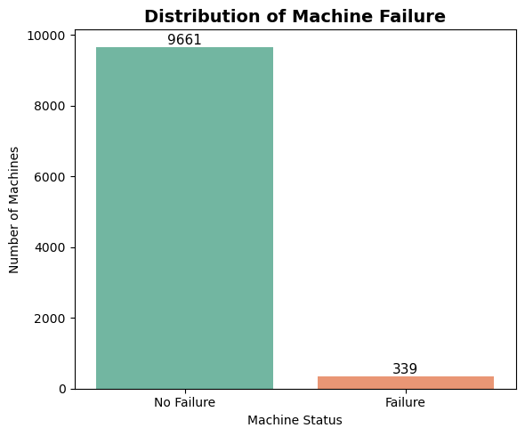
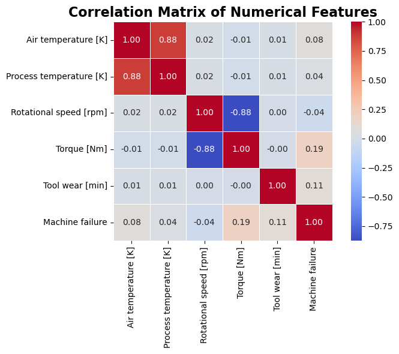
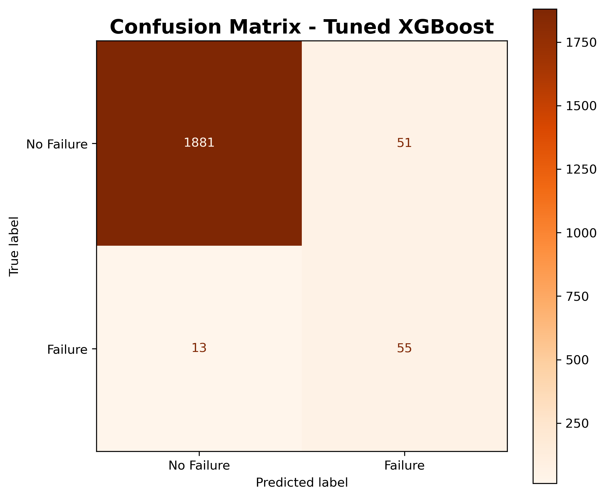
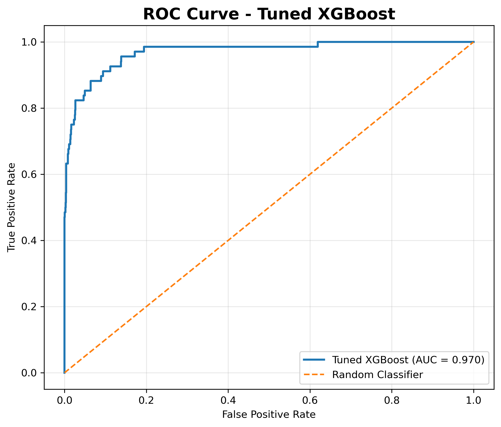
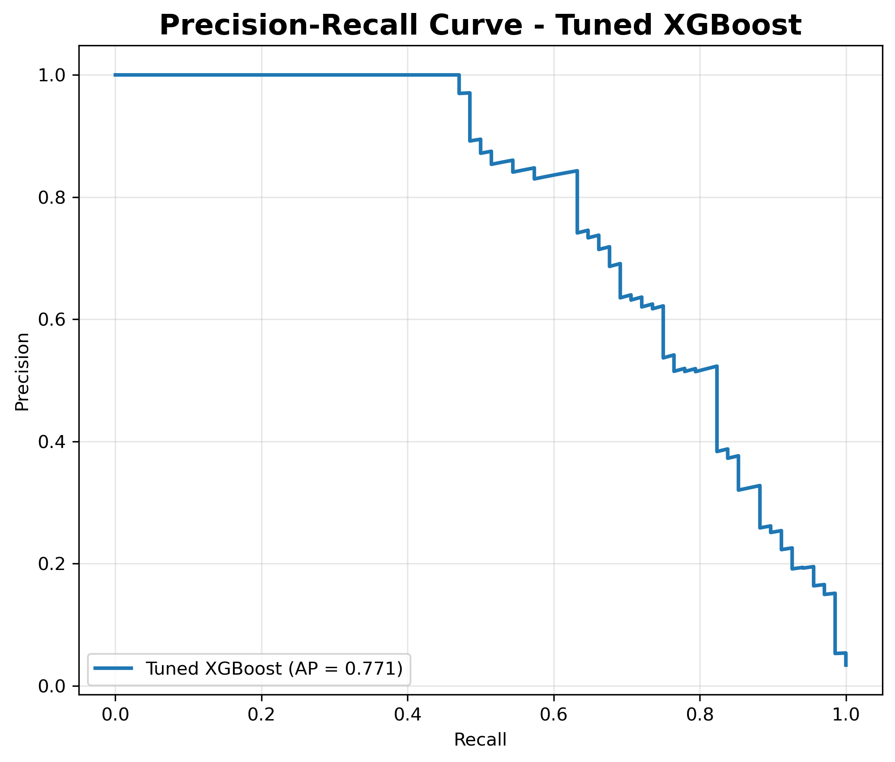
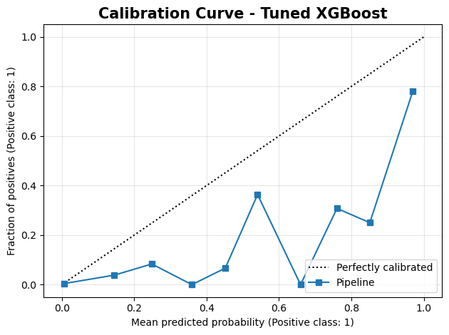
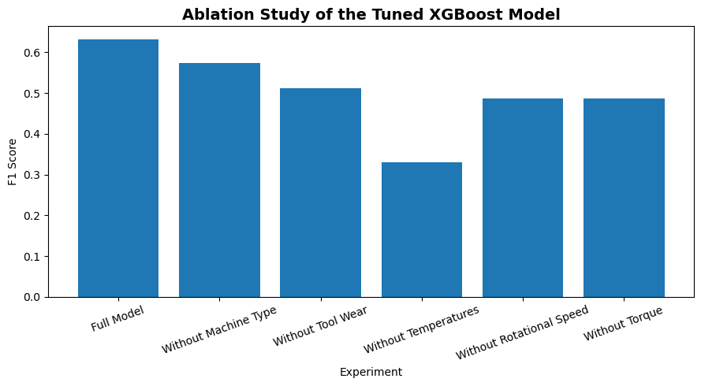
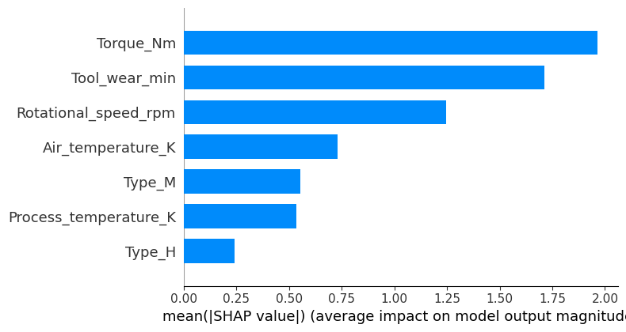
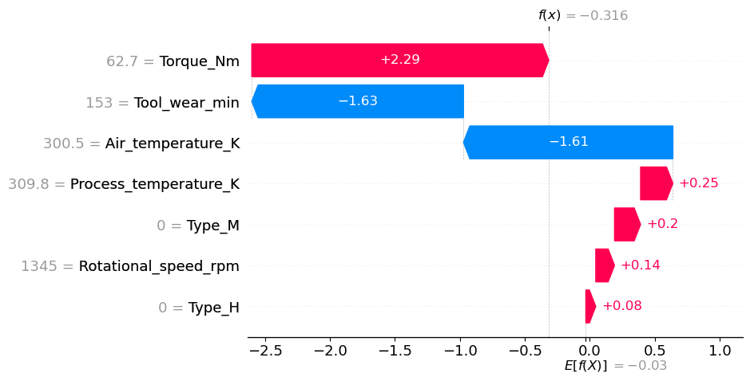
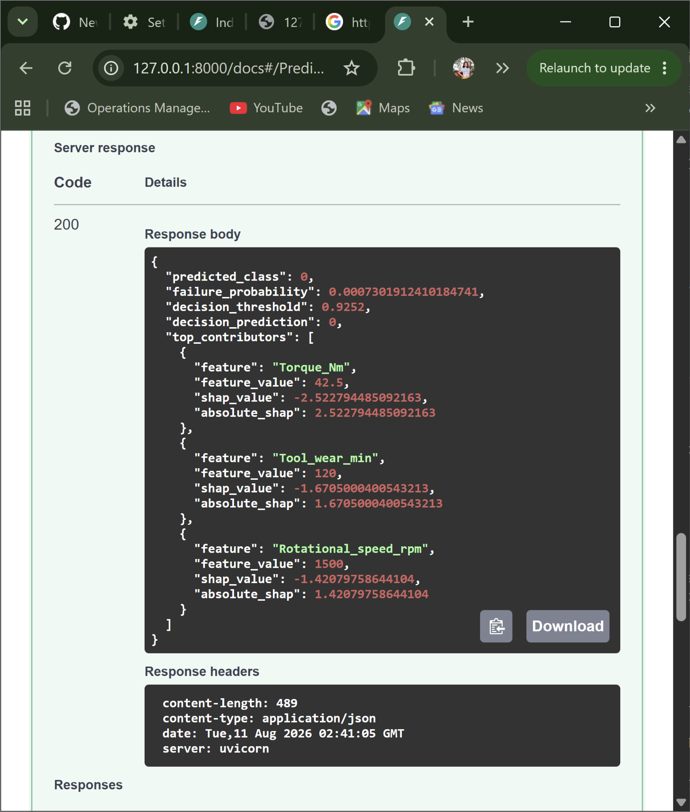

# Industrial Predictive Maintenance Using Explainable Machine Learning

## Project Overview

Industrial equipment failures can result in unplanned downtime, increased maintenance costs, production delays, and reduced operational efficiency. Traditional maintenance strategies, such as corrective maintenance and fixed-interval preventive maintenance, may not identify equipment that is approaching failure early enough for effective intervention.

This project develops an explainable machine learning framework for predicting equipment failure using the AI4I 2020 Predictive Maintenance Dataset. Multiple classification algorithms, including Logistic Regression, Random Forest, and XGBoost, are developed and evaluated to determine an effective approach for machine failure prediction.

To improve model transparency and interpretability, the project integrates Explainable Artificial Intelligence (XAI) using SHAP (SHapley Additive exPlanations). SHAP provides both global and local explanations, helping to identify the features that influence the model overall as well as the factors contributing to individual machine failure predictions.

The project implements an end-to-end machine learning workflow covering exploratory data analysis, data preprocessing, feature engineering, model development, hyperparameter tuning, model evaluation, probability calibration analysis, decision-threshold optimisation, statistical model comparison, and SHAP-based explainability.

The final predictive system is exposed through a FastAPI REST API and an interactive Streamlit dashboard, enabling users to enter machine operating conditions, obtain failure-risk predictions, and examine the factors influencing individual predictions.

## Business Problem

Unexpected equipment failures remain one of the most significant challenges in industrial maintenance. Unplanned breakdowns can interrupt production, increase maintenance costs, reduce equipment availability, and create operational and safety risks.

Traditional maintenance strategies, including corrective maintenance and fixed-interval preventive maintenance, do not always identify machines that are approaching failure. Consequently, organisations may either perform unnecessary maintenance on healthy equipment or fail to detect early warning signs of impending equipment failure.

Machine learning provides an opportunity to analyse historical operational data and identify patterns associated with equipment failures. By predicting failure risk before breakdown occurs, maintenance teams can prioritise inspections, schedule maintenance proactively, reduce unplanned downtime, optimise maintenance resources, and improve overall asset reliability.

This project investigates whether explainable machine learning can effectively predict equipment failure while providing transparent and interpretable explanations to support maintenance decision-making.

## Project Objectives

The primary objective of this project is to develop an explainable machine learning framework for predicting equipment failure using operational machine data.

The specific objectives are to:

- Perform exploratory data analysis to understand the characteristics of the predictive maintenance dataset.
- Prepare and preprocess the dataset for machine learning, including feature selection and class imbalance handling.
- Develop and compare multiple machine learning models, including Logistic Regression, Random Forest, and XGBoost.
- Optimise model performance using hyperparameter tuning and stratified cross-validation.
- Evaluate model performance using multiple metrics, including Accuracy, Precision, Recall, F1 Score, ROC-AUC, Average Precision, confusion matrices, and calibration analysis.
- Improve operational decision-making through probability threshold optimisation.
- Interpret model predictions using SHAP to provide both global and local explanations.
- Assess the statistical significance of model performance differences using McNemar's test.
- Investigate the contribution of important feature groups through an ablation study.
- Deploy the trained machine learning pipeline through a FastAPI REST API with an interactive Streamlit dashboard for real-time machine failure prediction and explainability.

## Dataset

This project uses the **AI4I 2020 Predictive Maintenance Dataset**, a publicly available benchmark dataset developed for predictive maintenance research. The dataset contains simulated industrial machine operating conditions and is widely used for evaluating machine learning approaches to equipment failure prediction.

The dataset consists of **10,000 machine records** containing operational measurements, machine characteristics, and failure information. It includes both numerical and categorical variables describing the operating conditions of each machine.

For model development, identifier variables (`UDI` and `Product ID`) were excluded because they do not provide meaningful predictive information. Individual failure mechanism indicators (`TWF`, `HDF`, `PWF`, `OSF`, and `RNF`) were also excluded to prevent target leakage, as they directly represent specific failure mechanisms associated with the target variable.

The categorical machine type variable was one-hot encoded, with Low (`L`) used as the reference category. The final model therefore uses seven predictor variables: five operational features and two encoded machine-type indicators.

## Dataset Overview

Before model development, the dataset was inspected to evaluate its structure and data quality.

### Dataset Summary

| Characteristic | Value |
|----------------|------:|
| Number of observations | 10,000 |
| Number of original columns | 14 |
| Missing values | None |
| Duplicate records | None |
| Memory usage | Approximately 1.1 MB |

Inspection of the dataset showed that all variables contained complete observations, with no missing values or duplicate records. The dataset consisted of nine integer variables, three floating-point variables, and two categorical variables, providing a clean foundation for subsequent exploratory analysis and preprocessing.

## Exploratory Data Analysis

Exploratory Data Analysis (EDA) was conducted to understand the characteristics of the AI4I 2020 Predictive Maintenance Dataset before model development. The analysis focused on class distribution, feature distributions, relationships between operational variables, machine type, and failure behaviour.

The exploratory analysis identified several important characteristics of the dataset:

- The target variable is highly imbalanced, with machine failures representing approximately 3.39% of all observations.
- Machine failure rates vary across machine types.
- Operational variables such as temperature, rotational speed, torque, and tool wear exhibit different patterns in relation to machine failure.
- The failure mechanism indicators provide additional insight into the types of failures represented in the original dataset.

### Machine Failure Distribution

The target variable is highly imbalanced, with 9,661 observations representing normal operation and 339 observations representing machine failure. Therefore, machine failures account for approximately 3.39% of the dataset.

<p align="center">
  
</p>

**Figure.** Distribution of the machine failure target variable, illustrating the substantial class imbalance in the dataset.

### Feature Correlation Analysis

Correlation analysis was performed to examine linear relationships among the numerical variables. Air temperature and process temperature showed a strong positive correlation (0.88), while rotational speed and torque showed a strong negative correlation (-0.88).

The individual numerical features showed relatively weak linear correlations with machine failure. Torque had the strongest positive correlation with the target (0.19), followed by tool wear (0.11). These relationships suggest that machine failure cannot be explained by simple linear associations alone, supporting the use of machine learning models capable of capturing more complex patterns and feature interactions.

<p align="center">
  
</p>

**Figure.** Correlation matrix of numerical operational features and the machine failure target.

The following sections present the key findings from the exploratory analysis.

### Features

| Feature | Description |
|---------|-------------|
| Air_temperature_K | Air temperature (Kelvin) |
| Process_temperature_K | Process temperature (Kelvin) |
| Rotational_speed_rpm | Machine rotational speed (RPM) |
| Torque_Nm | Applied torque (Newton metres) |
| Tool_wear_min | Accumulated tool wear (minutes) |
| Type | Machine type (Low, Medium, High) |
| Machine failure | Target variable indicating equipment failure |

For model development, the categorical machine type was one-hot encoded into two binary variables (`Type_M` and `Type_H`), with **Low-quality machines used as the reference category**. The `Machine failure` variable was used as the binary prediction target.

The final deployed machine learning pipeline uses the following seven predictor variables:

- `Air_temperature_K`
- `Process_temperature_K`
- `Rotational_speed_rpm`
- `Torque_Nm`
- `Tool_wear_min`
- `Type_M`
- `Type_H`

The processed dataset used in this project is stored in:

```text
data/processed/ai4i2020_processed.csv
```

The original benchmark dataset is publicly available from the UCI Machine Learning Repository:

https://archive.ics.uci.edu/dataset/601/ai4i+2020+predictive+maintenance+dataset

> **Note:** This repository uses the public AI4I 2020 benchmark dataset for research and demonstration purposes. It does not contain proprietary or confidential industrial data.

### Folder Description

| Folder | Purpose |
|--------|---------|
| **app** | Contains the FastAPI REST API, including the application entry point, prediction routes, model loading, and request/response schemas. |
| **data** | Stores the original dataset and the processed dataset used for model development and evaluation. |
| **images** | Stores EDA figures, model evaluation plots, SHAP visualisations, and deployment screenshots used in the project documentation. |
| **models** | Stores the trained machine learning pipeline used for prediction and deployment. |
| **notebooks** | Contains the Jupyter notebook documenting the end-to-end machine learning workflow, from exploratory data analysis through model evaluation and explainability. |
| **reports** | Stores generated evaluation results, metrics, and exported reports. |
| **src** | Contains reusable Python modules for data preprocessing, model training, evaluation, prediction, explainability, utilities, and project configuration. |
| **tests** | Contains automated tests used to verify the correctness and reliability of the project modules. 

## Repository Structure

The repository is organised to support a complete end-to-end machine learning workflow, from data preparation and model development to explainability, testing, and deployment.

```text
industrial-predictive-maintenance-machine-learning/
│
├── app/                         # FastAPI REST API
├── data/
│   ├── raw/                     # Original dataset
│   └── processed/               # Processed dataset used for modelling
├── images/                      # EDA, evaluation, SHAP and deployment figures
├── models/                      # Saved trained machine learning pipeline
├── notebooks/                   # Jupyter notebooks documenting the analysis
├── reports/                     # Evaluation results and generated reports
├── src/                         # Reusable machine learning source code
├── tests/                       # Automated tests
├── streamlit_app.py             # Interactive Streamlit dashboard
├── .gitignore
├── DATA_DICTIONARY.md
├── LICENSE
├── README.md
└── requirements.txt

## Machine Learning Workflow

The project follows a structured end-to-end machine learning workflow to ensure reproducibility, transparency, and reliable model evaluation.

### Workflow

```text
AI4I 2020 Dataset
        │
        ▼
Data Understanding
        │
        ▼
Data Cleaning
        │
        ▼
Exploratory Data Analysis (EDA)
        │
        ▼
Feature Engineering
        │
        ▼
Data Preprocessing
(Feature Selection, Encoding, Train/Test Split)
        │
        ▼
Model Development
(Logistic Regression, Random Forest, XGBoost)
        │
        ▼
Training Pipeline
(Scaling where required + SMOTE on Training Data)
        │
        ▼
Cross-Validation and Hyperparameter Tuning
        │
        ▼
Model Evaluation
        │
        ▼
Calibration Analysis
        │
        ▼
Threshold Optimisation
        │
        ▼
Statistical Validation
(McNemar's Test)
        │
        ▼
Model Explainability
(SHAP)
        │
        ▼
Ablation Study
        │
        ▼
Deployment
(FastAPI REST API + Streamlit Dashboard)

## Model Development

Three supervised machine learning models were developed and compared for the binary classification task of predicting machine failure.

### Workflow Description

The workflow begins with understanding and cleaning the dataset before performing exploratory data analysis (EDA) to examine data characteristics, class distribution, feature behaviour, and potential data quality issues. Feature engineering and preprocessing are then applied to prepare the data for machine learning.

To address class imbalance, SMOTE is applied exclusively to the training data within the machine learning pipeline. Three classification models—Logistic Regression, Random Forest, and XGBoost—are developed and compared using stratified cross-validation and multiple classification metrics. Hyperparameter tuning is subsequently performed to optimise model performance while maintaining a leakage-safe training process.

The tuned XGBoost model is selected as the final model and further evaluated through probability calibration analysis, decision-threshold optimisation, McNemar's statistical significance test, SHAP-based explainability, and an ablation study to assess predictive performance, robustness, and feature contributions.

The trained XGBoost pipeline is then deployed through a FastAPI REST API and an interactive Streamlit dashboard, enabling real-time machine failure prediction, failure-probability estimation, threshold-based maintenance decisions, and local SHAP explanations for individual predictions.

### Logistic Regression

Logistic Regression was used as the baseline model because it provides a simple, interpretable, and computationally efficient reference for binary classification. Numerical features were standardised within the machine learning pipeline, while SMOTE was applied exclusively to the training data to address class imbalance and prevent data leakage.

### Random Forest

Random Forest was selected because it can capture non-linear relationships and complex interactions between operational variables without requiring feature scaling. Both baseline and hyperparameter-tuned Random Forest models were developed and evaluated to assess whether model optimisation improved predictive performance.

### XGBoost

XGBoost was selected as an advanced gradient boosting algorithm well suited to structured tabular data. It was evaluated as both a baseline model and a hyperparameter-tuned model.

Hyperparameter optimisation was performed using `RandomizedSearchCV` with stratified cross-validation. To prevent data leakage, SMOTE was incorporated within the machine learning pipeline and applied only to the training folds during cross-validation.

The tuned XGBoost model demonstrated the strongest overall performance across the evaluated classification and ranking metrics, including Precision, Recall, F1 Score, ROC-AUC, and Average Precision. It was therefore selected as the final model for further evaluation, SHAP-based explainability, threshold optimisation, and deployment.
---

## Model Evaluation and Validation

The predictive models were evaluated using an independent test set together with stratified cross-validation. Given the class imbalance in the dataset (approximately **3.39%** machine failures), model performance was assessed using multiple complementary evaluation metrics rather than relying solely on accuracy.

### Evaluation Metrics

The following metrics were used to evaluate model performance:

- Accuracy
- Precision
- Recall
- F1 Score
- ROC-AUC
- Average Precision (AP)
- Confusion Matrix

Accuracy measures overall classification performance, while Precision, Recall, and F1 Score provide a more informative assessment of performance on the minority failure class. ROC-AUC evaluates the model's ability to discriminate between failure and non-failure cases across different classification thresholds. Average Precision (AP) summarises performance across the Precision–Recall curve and is particularly informative for imbalanced classification problems.

In addition to these metrics, probability calibration and decision-threshold optimisation were performed to assess the reliability of predicted probabilities and improve the practical use of model predictions for maintenance decision-making.

### Confusion Matrix

The confusion matrix provides a detailed view of the classification performance of the final tuned XGBoost model on the independent test set.

<p align="center">
  
</p>

The final tuned XGBoost model correctly classified **1,881 non-failure cases** and **55 machine failures**. It produced **51 false positives** and **13 false negatives**.

These results demonstrate that the model maintains strong failure detection while limiting the number of unnecessary failure alerts.

### Cross-Validation Results

Five-fold stratified cross-validation was performed to evaluate model generalisation and compare the baseline classification models.

| Model | Accuracy | Precision | Recall | F1 Score | ROC-AUC | Average Precision |
|-------|---------:|----------:|-------:|---------:|--------:|------------------:|
| Logistic Regression | 0.840 | 0.146 | 0.761 | 0.245 | 0.884 | 0.385 |
| Random Forest | 0.961 | 0.452 | 0.732 | 0.558 | 0.963 | 0.649 |
| XGBoost | 0.959 | 0.447 | **0.829** | **0.580** | **0.967** | **0.750** |

The cross-validation results show that XGBoost achieved the strongest overall balance across the evaluated metrics. Although Random Forest produced slightly higher Accuracy and Precision, XGBoost achieved the highest Recall, F1 Score, ROC-AUC, and Average Precision.

The higher Recall indicates stronger detection of the minority failure class, while the higher Average Precision demonstrates better performance across the Precision–Recall trade-off. These results supported further optimisation and evaluation of XGBoost.


Following hyperparameter optimisation using `RandomizedSearchCV`, the tuned XGBoost pipeline was evaluated on the independent test set. SMOTE was incorporated within the training pipeline to prevent data leakage during model development.

| Metric | Value |
|--------|------:|
| Accuracy | **0.968** |
| Precision | **0.519** |
| Recall | **0.809** |
| F1 Score | **0.632** |
| ROC-AUC | **0.970** |
| Average Precision (AP) | **0.771** |

The tuned XGBoost model achieved a strong overall balance between failure detection and classification performance. In particular, the model achieved a Recall of **0.809**, indicating that it identified approximately 80.9% of failure cases in the independent test set, while maintaining a Precision of **0.519**.

### ROC Curve

The Receiver Operating Characteristic (ROC) curve evaluates the ability of the final tuned XGBoost model to distinguish between machine failure and non-failure cases across different classification thresholds.

<p align="center">
  
</p>

The final tuned XGBoost model achieved a **ROC-AUC of 0.970**, demonstrating strong discrimination between failure and non-failure cases.

### Precision–Recall Curve

The Precision–Recall curve provides a more informative evaluation of the final tuned XGBoost model on the minority failure class, particularly because machine failures represent only approximately **3.39%** of the dataset.

<p align="center">
  
</p>

The final tuned XGBoost model achieved an **Average Precision (AP) of 0.771**, indicating strong performance in identifying machine failures despite the substantial class imbalance.

Together with an ROC-AUC of **0.970** and Average Precision of **0.771**, these results supported the selection of the tuned XGBoost pipeline as the final model for further validation, SHAP-based explainability, threshold optimisation, and deployment.

### Probability Calibration

Probability calibration was assessed using the Brier Score, which measures the mean squared difference between predicted probabilities and observed outcomes. Lower values indicate more accurate probabilistic predictions.

| Metric | Value |
|--------|------:|
| Model Brier Score | **0.0253** |
| Baseline Brier Score | **0.0328** |

The tuned XGBoost model achieved a lower Brier Score than the baseline, indicating more accurate probability estimates relative to the baseline prediction. This supports the use of the model's predicted failure probabilities as part of the subsequent threshold-based maintenance decision process.

<p align="center">
  
</p>

**Figure.** Calibration curve for the tuned XGBoost model compared with perfect calibration.

The lower Brier Score indicates that the predicted probabilities are better calibrated than the baseline model, increasing confidence in the estimated machine failure probabilities used for operational decision-making.


### Threshold Optimisation

Rather than relying on the default classification threshold of 0.50, decision-threshold optimisation was performed to maximise the F1 Score.

| Metric | Value |
|--------|------:|
| Optimal Decision Threshold | **0.9252** |
| Optimised Precision | **0.840** |
| Optimised Recall | **0.632** |
| Optimised F1 Score | **0.723** |

Applying the optimised decision threshold increased Precision while maintaining meaningful detection of machine failures, producing an F1 Score of **0.723**. The higher threshold reduces false positive maintenance decisions compared with the default 0.50 threshold, helping to limit unnecessary maintenance interventions while retaining useful failure detection capability.

The optimised threshold of **0.9252** is used as the operational decision threshold in the deployed FastAPI and Streamlit applications.

<p align="center">
  
</p>

**Figure.** Precision, recall, and F1 Score across decision thresholds for the final tuned XGBoost model. The selected operational threshold is approximately **0.925**.

### Statistical Validation

Model performance differences were further assessed using McNemar's test, which evaluates whether two classifiers produce significantly different error patterns on the same test observations.

| Statistic | Value |
|-----------|------:|
| McNemar Statistic | **24.75** |
| p-value | **6.53 × 10⁻⁷** |

The very small p-value indicates a statistically significant difference in the prediction errors of the models being compared. Combined with the performance metrics reported above, this provides statistical evidence that the observed difference in predictive performance is unlikely to be attributable to random variation alone.

### Ablation Study

An ablation study was performed to investigate the contribution of different feature groups to the predictive performance of the final tuned XGBoost model. Each experiment removed a selected feature or feature group while retaining the remaining modelling configuration.

| Experiment | Accuracy | Precision | Recall | F1 Score | ROC-AUC |
|------------|---------:|----------:|-------:|---------:|--------:|
| Full Model | **0.9680** | **0.5189** | **0.8088** | **0.6322** | 0.9700 |
| Without Machine Type | 0.9600 | 0.4500 | 0.7941 | 0.5745 | **0.9715** |
| Without Tool Wear | 0.9600 | 0.4375 | 0.6176 | 0.5122 | 0.8470 |
| Without Temperatures | 0.9190 | 0.2299 | 0.5882 | 0.3306 | 0.9102 |
| Without Rotational Speed | 0.9515 | 0.3802 | 0.6765 | 0.4868 | 0.9329 |
| Without Torque | 0.9485 | 0.3684 | 0.7206 | 0.4876 | 0.9266 |

The ablation results show that removing the temperature features caused the largest reduction in F1 Score, decreasing from **0.6322** to **0.3306**. Removing rotational speed, torque, or tool wear also reduced predictive performance, demonstrating that these operational variables contribute meaningful information to failure prediction.

Removing machine type produced a smaller reduction in Accuracy, Precision, Recall, and F1 Score, although ROC-AUC increased slightly from **0.9700** to **0.9715**. This indicates that machine type contributes to the overall classification performance even though its removal did not reduce discrimination as measured by ROC-AUC.

Overall, the full feature set provided the strongest balance across the operationally relevant classification metrics, supporting its use in the final model.
<p align="center">
  
</p>

**Figure.** Effect of feature-group removal on tuned XGBoost model performance.


## Explainable Artificial Intelligence (XAI)

High predictive performance alone is often insufficient for industrial applications. Maintenance engineers and decision-makers also need to understand why a machine has been classified as high or low risk before taking corrective action.

To improve model transparency and interpretability, this project integrates Explainable Artificial Intelligence (XAI) using SHAP (SHapley Additive exPlanations). SHAP provides both global and local explanations by quantifying how individual features contribute to the model's predictions.

Global SHAP analysis was used to understand the features that influence predictions across the dataset, while local SHAP explanations were used to examine the factors driving individual machine failure predictions.

### Global Explainability

Global SHAP analysis was used to identify the features that influenced model predictions across the evaluation dataset. The analysis showed that several operational and machine-related variables contributed meaningfully to the model's predictions, including:

- Rotational Speed
- Torque
- Machine Type
- Tool Wear
- Air Temperature
- Process Temperature

The SHAP analysis demonstrates that the model relies on a combination of operational sensor measurements and machine characteristics rather than a single predictor when estimating machine failure risk.

Two complementary SHAP visualisations were used to examine global model behaviour.

#### Mean Absolute SHAP Importance

<p align="center">
  
</p>

**Figure.** Global feature importance based on mean absolute SHAP values.

Mean absolute SHAP values summarise the average magnitude of each feature's contribution across observations. Larger values indicate features that have a greater overall influence on the model's predictions, regardless of whether that influence increases or decreases the model output.


#### SHAP Summary Plot

<p align="center">
  
</p>

**Figure.** SHAP summary plot showing the magnitude and direction of feature contributions.

The SHAP summary plot provides additional information about how feature values influence predictions. Each point represents an observation, while its horizontal position represents the SHAP contribution. Positive SHAP values push the model output toward the failure class, whereas negative SHAP values push it away from the failure class.


### Local Explainability

Local SHAP explanations were generated for individual machine records to identify the factors contributing to specific predictions. Unlike global feature importance, which describes model behaviour across many observations, local explanations show how individual feature values influence a single prediction.

For each machine, positive SHAP contributions push the model output toward the failure class, while negative SHAP contributions push the model output away from the failure class. The magnitude of each SHAP value indicates the strength of that feature's contribution to the individual prediction.

The example below illustrates a machine classified as a failure case and shows how its individual feature values contributed to the model's prediction.

<p align="center">
  
</p>

**Figure.** Local SHAP waterfall explanation for an individual machine failure prediction.

The waterfall plot begins from the model's baseline output and shows how each feature moves the prediction toward its final model output. Features with positive contributions increase the model's tendency toward the failure class, while features with negative contributions reduce it. This provides an interpretable explanation of why the model produced the prediction for that specific machine.


### Supporting Maintenance Decisions

The SHAP explanations provide interpretable evidence that can support maintenance planning by helping engineers to:

- Understand why a machine has been classified as high risk.
- Identify the operational factors contributing to the model's failure-risk prediction.
- Support the prioritisation of machines for further inspection or maintenance assessment.
- Improve transparency and confidence when interpreting machine learning predictions.

By combining predictive modelling with explainable AI, the framework provides both failure-risk predictions and interpretable evidence about the factors influencing those predictions. This supports more transparent and informed maintenance decision-making rather than relying solely on a black-box classification output.

## Key Contributions

This project makes the following technical and practical contributions:

- Developed an end-to-end explainable machine learning framework for industrial predictive maintenance using the AI4I 2020 Predictive Maintenance Dataset.

- Compared three supervised machine learning models—Logistic Regression, Random Forest, and XGBoost—using consistent preprocessing and evaluation procedures.

- Addressed class imbalance by applying SMOTE exclusively to the training data within the machine learning pipeline, reducing the risk of data leakage.

- Optimised the XGBoost model through hyperparameter tuning using `RandomizedSearchCV` with stratified cross-validation.

- Evaluated model performance using multiple complementary metrics, including Accuracy, Precision, Recall, F1 Score, ROC-AUC, Average Precision (AP), and confusion matrices.

- Assessed probability reliability through calibration analysis and optimised the operational decision threshold to improve the balance between failure detection and false positive maintenance decisions.

- Applied McNemar's statistical significance test to assess differences in model prediction errors.

- Performed an ablation study to evaluate the contribution of individual features and feature groups to predictive performance.

- Integrated SHAP-based explainability to provide both global model interpretation and local explanations for individual machine predictions.

- Deployed the final tuned XGBoost machine learning pipeline through a FastAPI REST API and an interactive Streamlit dashboard for real-time failure prediction, threshold-based decision support, and local model explainability.

Together, these contributions demonstrate a complete end-to-end machine learning workflow that extends beyond predictive modelling to include model validation, explainability, statistical analysis, and deployment for industrial maintenance decision support.

## Installation

### Clone the Repository

```bash
git clone https://github.com/Vivaluv/industrial-predictive-maintenance-machine-learning.git

cd industrial-predictive-maintenance-machine-learning
```

### Create a Virtual Environment

#### Windows

```bash
python -m venv venv
```

Activate the virtual environment:

```bash
venv\Scripts\activate
```

If PowerShell prevents script execution, run:

```powershell
Set-ExecutionPolicy -Scope Process -ExecutionPolicy Bypass
```

Then activate the environment:

```powershell
.\venv\Scripts\Activate.ps1
```

#### Linux / macOS

```bash
python3 -m venv venv
source venv/bin/activate
```

### Install Required Packages

```bash
python -m pip install -r requirements.txt
```

The project was developed and tested using **Python 3.13.9**. Install all required dependencies before running the notebooks, tests, API, or Streamlit application.

## Project Usage

After installing the required dependencies, the project can be tested and the deployed prediction system can be run locally.

### Run the Test Suite

Before starting the application, run the automated tests to verify that the project modules are functioning correctly:

```bash
python -m pytest -v
```

The current project test suite contains **26 tests**, covering data preprocessing, model training, evaluation, prediction, SHAP explainability, and utility functions.

### Start the FastAPI Backend

The final tuned XGBoost pipeline is served through a FastAPI REST API.

From the project root, run:

```bash
python -m uvicorn app.main:app --host 127.0.0.1 --port 8000
```

When the server starts successfully, the API is available at:

```text
http://127.0.0.1:8000
```

The health-check endpoint is available at:

```text
http://127.0.0.1:8000/health
```

Interactive FastAPI documentation is available at:

```text
http://127.0.0.1:8000/docs
```

Keep the FastAPI terminal running while using the Streamlit dashboard.

### Start the Streamlit Dashboard

Open a second terminal, activate the same virtual environment, and run:

```bash
python -m streamlit run streamlit_app.py
```

The Streamlit application will open in the browser and provide an interactive interface for entering machine operating conditions and generating predictions.

The dashboard displays:

- Predicted machine failure class.
- Failure probability.
- Operational decision threshold (`0.9252`).
- Threshold-based maintenance decision.
- Top local SHAP feature contributions.
- SHAP feature-impact visualisation.

### Prediction Workflow

The deployed prediction workflow is:

```text
Machine Operating Inputs
        │
        ▼
Streamlit Dashboard
        │
        ▼
FastAPI REST API
        │
        ▼
Tuned XGBoost Pipeline
        │
        ▼
Failure Probability
        │
        ▼
Operational Threshold (0.9252)
        │
        ▼
Maintenance Decision
        │
        ▼
Local SHAP Explanation
        │
        ▼
Streamlit Dashboard


```
## Deployment

The final tuned XGBoost machine learning pipeline is deployed through a two-layer application architecture consisting of a FastAPI REST API and an interactive Streamlit dashboard.

### FastAPI REST API

FastAPI provides the backend prediction service. It receives machine operating conditions from the client application, validates the input data, loads the trained XGBoost pipeline, generates the machine failure probability, applies the operational decision threshold, and returns the prediction results together with local SHAP explanations.

The API exposes a `/predict` endpoint for machine failure prediction and a `/health` endpoint for checking service availability. Interactive API documentation is available through FastAPI's Swagger interface at `/docs`.

<p align="center">
  
</p>

**Figure.** FastAPI Swagger interface showing a successful `/predict` request and model response with failure probability, operational decision threshold, and local SHAP contributors.

### Streamlit Dashboard

The Streamlit dashboard provides an interactive user interface for the predictive maintenance system. Users can enter machine operating conditions and submit them to the FastAPI prediction service.

The dashboard presents:

- Predicted machine failure class.
- Failure probability.
- Operational decision threshold (`0.9252`).
- Threshold-based maintenance decision.
- Top contributing features for the individual prediction.
- Local SHAP feature contributions and feature-impact visualisation.

<p align="center">
  
</p>

**Figure.** Interactive Streamlit predictive maintenance dashboard showing an individual machine prediction and SHAP-based explanation.


### Application Architecture

```text
Machine Operating Conditions
            │
            ▼
    Streamlit Dashboard
            │
       HTTP Request
            ▼
      FastAPI REST API
            │
            ▼
 Tuned XGBoost Pipeline
            │
      ┌─────┴─────┐
      ▼           ▼
Failure       Local SHAP
Probability   Explanation
      │           │
      └─────┬─────┘
            ▼
Operational Threshold
      (0.9252)
            │
            ▼
 Prediction Response
            │
            ▼
    Streamlit Dashboard
```

This architecture separates the machine learning prediction service from the user interface, providing a modular structure that can be extended to other applications or deployment environments.

## Project Outputs

The project produces the following outputs:

- Cleaned and processed AI4I 2020 predictive maintenance dataset.
- Trained Logistic Regression, Random Forest, and XGBoost models.
- Hyperparameter tuning and cross-validation results.
- Model evaluation results, including confusion matrices, ROC curves, and Precision–Recall curves.
- Probability calibration analysis and calibration curve.
- Optimised operational decision threshold (`0.9252`).
- McNemar statistical significance test results.
- Ablation study results evaluating feature-group contributions.
- SHAP-based global feature importance and local prediction explanations.
- Final tuned XGBoost machine learning pipeline.
- FastAPI REST API for real-time machine failure prediction.
- Interactive Streamlit dashboard for failure-risk prediction, threshold-based decision support, and local SHAP explainability.

## Future Work

Several opportunities exist to further extend and enhance this project.

Future improvements include:

- Validate the framework using real-world industrial predictive maintenance datasets.
- Integrate live IoT sensor streams for real-time equipment monitoring and prediction.
- Containerise the FastAPI and Streamlit applications using Docker to improve portability and deployment reproducibility.
- Deploy the system to a cloud platform to support scalable real-time predictive maintenance services.
- Implement user authentication, access control, and API security for production environments.
- Introduce continuous model monitoring to detect performance degradation and concept drift over time.
- Automate model retraining as new operational data becomes available.
- Investigate deep learning approaches, including recurrent neural networks (RNNs) and transformer-based architectures, particularly for future predictive maintenance applications involving sequential or time-series sensor data.

## References

1. Matzka, S. (2020). *AI4I 2020 Predictive Maintenance Dataset*. UCI Machine Learning Repository.  
   https://archive.ics.uci.edu/dataset/601/ai4i+2020+predictive+maintenance+dataset

2. Lundberg, S. M., & Lee, S.-I. (2017). *A Unified Approach to Interpreting Model Predictions*. Advances in Neural Information Processing Systems (NeurIPS), 30.

3. Pedregosa, F., et al. (2011). *Scikit-learn: Machine Learning in Python*. Journal of Machine Learning Research, 12, 2825–2830.

4. Chen, T., & Guestrin, C. (2016). *XGBoost: A Scalable Tree Boosting System*. Proceedings of the 22nd ACM SIGKDD International Conference on Knowledge Discovery and Data Mining, 785–794.

## License

This project is distributed under the **MIT License**.

See the `LICENSE` file for additional information.